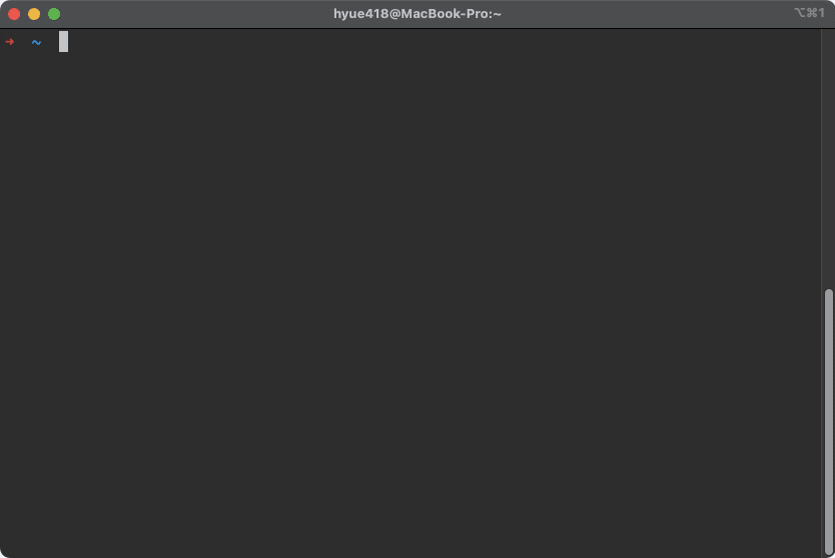

# go-rename 照片视频重命名工具

## 前言
`go-rename`是基于`Golang`语言开发的照片视频重命名工具，支持`Windows`/`MacOS`/`Linux`等各平台

开发初衷来自整理照片/视频的烦恼，单反相机和iPhone拍摄的照片生成的都是`IMG_0001.JPG` `IMG_0002.JPG`
之类的文件名，不同时期照片放到同一文件夹势必会出现重名问题，不方便浏览和整理。找了一圈网络并没有发现有合适的工具，遂决定开发一个。

## 演示

## 功能
* 支持根据`EXIF拍摄时间`重命名图片/视频文件
* 没有拍摄时间的支持按`创建时间`/`修改时间`重命名，或统一移至`unknown-date`文件夹(方便整理截图等无用图片)
* 支持根据`MD5`重命名照片/视频文件(用于文件去重)
* 图片文件将重命名为`IMG_20250606_121601.XXX`的格式
* 视频文件将重命名为`VID_20250606_121601.XXX`的格式
* 同名文件自动加`_1`/`_2`/`_N`后缀(去重模式除外)，防止连拍文件被覆盖

> 重命名视频文件需先安装mediainfo，运行请先备份